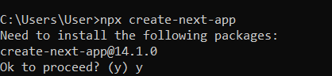
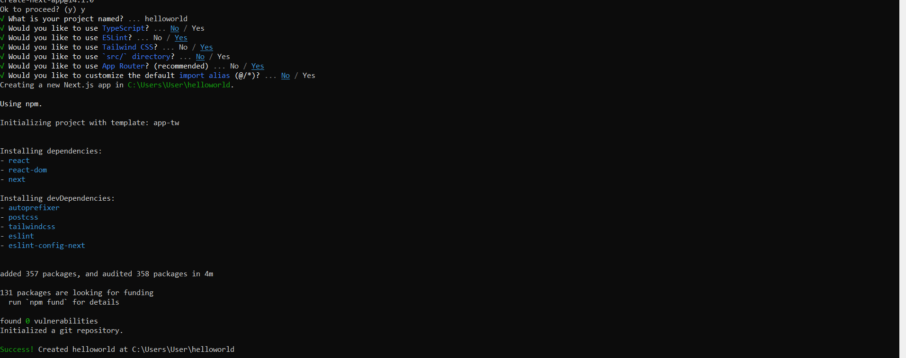
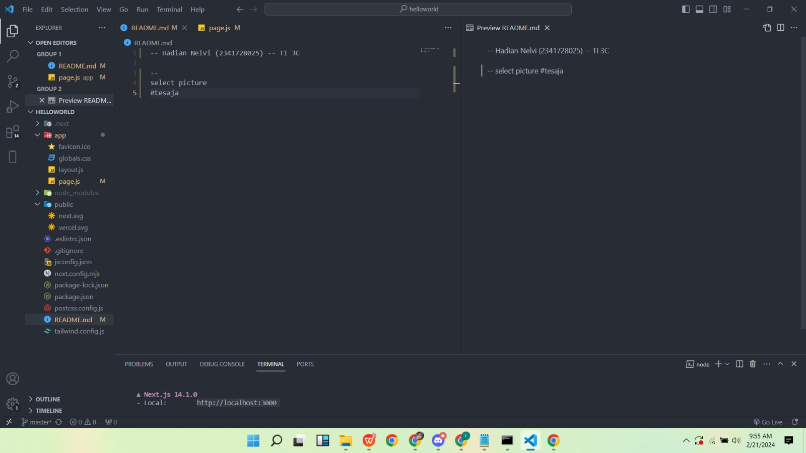

-- Hadian Nelvi (2341728025) -- TI 3C

Langkah 1 : membuar folder baru dengan create npx

Soal 1 :

A. Jelaskan apa yang dimaksud dengan TypeScript

(TypeScript adalah kode pada javascript yang berguna untuk mengatur tipe data. )

B . Jelaskan apa yang dimaksud dengan ESLint

(ESLint adalah alat analisis kode untuk memastikan kualitas penulisan kode )

C.Jelaskan apa yang dimaksud dengan Tailwind CSS

(TailwindCSS adalahs sebuah framework CSS yang bersifat utility-first untuk membuat desain antar muka yang khusus dan cepat .)

D.Jelaskan apa yang dimaksud dengan App Router

(App Router adalah sebuah aplikasi perangkat yang berfungsi untuk mentransmisikan paket data dari jaringan internet  ke perangkat lain melalui proses routing)

E. D.Jelaskan apa yang dimaksud dengan Import Alias 

(Import Alias ada cara alternatif untuk memberi nama atau singkatan pada modul baru yang di import)

#langkah 2 : membuat project baru helloworld

#langkah 3 : Buka kode helloworld di vs code

Soal No 2
A.Jelaskan Fungsi Folder .git

(Folder .git adalah folder yang berisi sistem kontrol dari Git untuk menyimpan semua informasi atau log perbaruan yang terjadi pada repositori git user seperti riwayat perubahan (Commit),Branch,Remote repositori dan kontrol yang lain.)

B.Jelaskan Fungsi Folder Node Modules

( Node Modules adalah direktori yang ada di node.js yang berguna sebagai tempat penyimpanan dan pengelolaan dependensi atau pihak ketiga yang di gunakan di proyek JavaScript)

C.Jelaskan Fungsi Folder Public

(Folder ini biasanya digunakan untuk menyimpan asset statis seperti gambar, font, atau file favicon yang akan disajikan langsung oleh server web tanpa memerlukan pemrosesan tambahan.)

D.Jelaskan Fungsi Folder src

(src adalah folder yang berguna untuk menyimpan semua file )

E.Jelaskan Fungsi file .eslintrc.json

( Berkas konfigurasi untuk ESLint, alat linting JavaScript.)

F.Jelaskan Fungsi file .eslintrc.json

(Berkas konfigurasi untuk ESLint, alat linting JavaScript.)

G. Jelaskan Fungsi file .gitignore

(Berkas ini berisi daftar pola file dan folder yang harus diabaikan oleh Git, artinya file dan folder yang tidak akan ditambahkan ke dalam repositori Git.)

H. Jelaskan fungsi file next.config.mjs

(Berkas ini adalah konfigurasi khusus untuk aplikasi Next.js, kerangka kerja React. Ini memungkinkan pengguna untuk menyesuaikan pengaturan dan perilaku aplikasi Next.js mereka.)

I. Jelaskan Fungsi file next-env.d.ts

(Berkas ini adalah file deklarasi TypeScript khusus untuk aplikasi Next.js. Ini mendefinisikan lingkungan TypeScript untuk proyek Next.js.)

J. Jelaskan Fungsi file package.json

(Berkas ini mungkin adalah konfigurasi khusus atau file proyek yang digunakan oleh aplikasi. Namun, tanpa konteks lebih lanjut, sulit untuk memberikan penjelasan yang lebih spesifik.)

K.  Jelaskan Fungsi file package-lock.json

(Ini mungkin adalah file yang dibuat oleh alat manajemen paket atau proyek yang digunakan untuk mengunci versi dependensi atau konfigurasi proyek.)

L. Jelaskan fungsi postcss.config.js

(Berkas ini adalah konfigurasi untuk PostCSS, alat pengolahan CSS yang dapat diintegrasikan dengan alat bundling seperti Webpack. Ini dapat digunakan untuk menulis CSS dengan sintaks modern dan mengotomatisasi beberapa tugas pengolahan.)

M. Jelaskan fungsi README.md

(Berkas ini adalah berkas Markdown yang digunakan untuk memberikan dokumentasi, instruksi, atau informasi tentang proyek kepada pengguna atau kontributor proyek.)

N. Jelaskan fungsi tailwind.config.ts

(Berkas ini adalah konfigurasi untuk Tailwind CSS, kerangka kerja CSS yang dapat disesuaikan. Ini memungkinkan pengguna untuk menyesuaikan tema, mengonfigurasi plugin, dan mengatur opsi lainnya.).

O. Jelaskan fungsi tsconfig.json

(Berkas ini adalah konfigurasi TypeScript yang mengatur opsi dan perilaku kompilasi TypeScript. Ini dapat digunakan untuk menentukan aturan, opsi, dan pengaturan lain yang berkaitan dengan proyek TypeScript Anda.)

#langkah 4 : menjalankan npm run dev

Soal No 3

 menganti nama dan nim pada bagian navbar

INSTALING Remix dan Getsby

Instaling Remix

Langkah 1: buat npx create remix

Langkah 2: Open Folder

Langkah 3 : Menjalankan npm run dev

Langkah 4 : hasil running npm run dev

Langkah 5 : Mengubah isi remix

Langkah 6 : Hasil Perubahan

Installing Getsby
Langkah 1: Installing Getsby

Langkah 2 : open folder Getsby

Langkah 3 : jalankan terminal getsby

Langkah 4 : Hasil Terminal

Perbedaan Next.js , Remix , Gatsby.js

1. Pendekatan pengembangan

Next.js: Next.js memberikan pendekatan yang fleksibel untuk pengembangan aplikasi web.Karna Next.js mengunakanSSR (Server-Side Rendering) atau SSG (Static Site Generation).

Remix: Remix mengadopsi pendekatan modern dengan fokus pada komposisi dan reusabilitas komponen.

Gatsby.js: Gatsby.js lebih terfokus pada pembangunan situs web statis dan dapat membuat situs web yang cepat dengan memanfaatkan SSG secara eksklusif.

2. Pengunaan

Next.js: Cocok untuk berbagai jenis proyek, Mulai dari aplikasi web sederhana hingga aplikasi yang kompleks.

Remix: Cocok untuk proyek-proyek yang menghargai pendekatan modern dalam pengembangan web dan perlu kinerja yang baik.

Gatsby.js: Ideal untuk pembangunan situs web statis, blog, dan aplikasi web yang membutuhkan kinerja yang cepat dan mudah dalam pengelolaan konten.

3. Ekosistem dan Komunitas

Next.js: Next.js memiliki ekosistem yang besar dan aktif dengan banyak plugin dan dukungan komunitas yang tersedia.

Remix: Meskipun Remix masih berkembang, ekosistemnya masih tidak sebesar Next.js. Namun, ada potensi pertumbuhan yang baik dan dukungan komunitas yang solid.

Gatsby.js: Gatsby memiliki ekosistem yang besar dengan banyak plugin dan tema yang tersedia, serta dukungan komunitas yang kuat.

